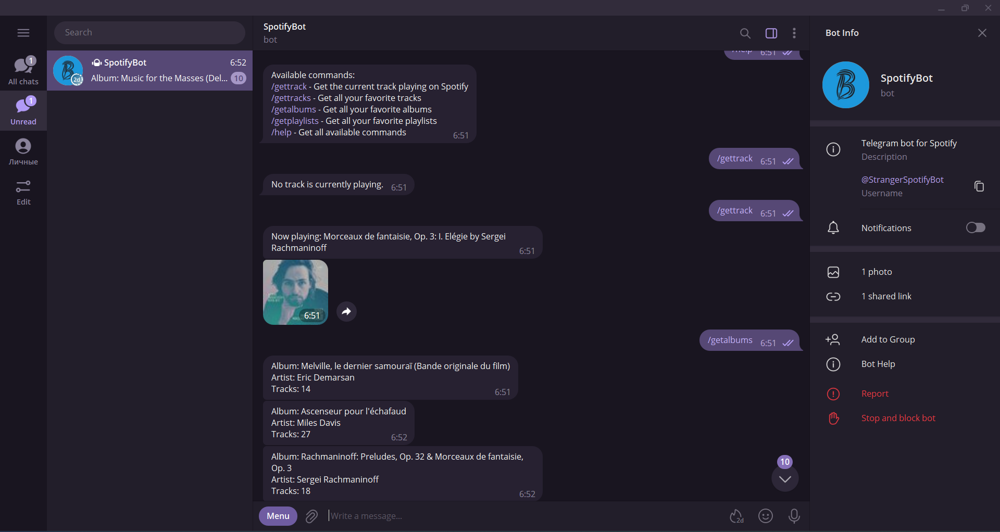

# TelegramBotForSpotify



This project is a Telegram bot that interacts with the Spotify API to provide various functionalities. The bot can authorize a user, fetch the current track, favorite tracks, favorite albums, and playlist information.
The bot supports XML export functionality for albums, tracks, and playlists, allowing users to save their Spotify data in a structured format for backup or analysis purposes.

## Note
Currently, my application is in Developer Mode on the Spotify Developer Dashboard. This means that in order for users to use the application, they need to be manually added by me. If you wish to use my application, please contact me so I can add you to the list of authorized users. I appreciate your understanding and cooperation.

## Commands
The bot supports the following commands:
```
/authorize: Authorizes the user.
/gettrack: Fetches the current track.
/gettracks: Fetches the user's favorite tracks.
/getalbums: Fetches the user's favorite albums.
/getplaylists: Fetches the user's playlists.
/help: Provides a list of available commands.
```
## Setup
To run this project, you need to create an appsettings.json file in the root directory with the following structure:
```
{
  "Logging": {
    "LogLevel": {
      "Default": "Information",
      "Microsoft.AspNetCore": "Warning"
    }
  },
  "AllowedHosts": "*",
  "Spotify": {
    "ClientId": "<Your Spotify Client ID>",
    "ClientSecret": "<Your Spotify Client Secret>",
    "RedirectUri": "http://localhost:8000/callback"
  },
  "Telegram": {
    "Token": "<Your Telegram Bot Token>"
  }
}
```
Replace "<Example>" <Your Spotify Client Secret>, and <Your Telegram Bot Token> with your actual Spotify Client ID, Spotify Client Secret, and Telegram Bot Token respectively.

## Running the Project
After setting up the appsettings.json file, you can run the project using your preferred .NET Core-compatible IDE or from the command line with the dotnet run command.

## Running the Application with Docker

1. Make sure you have Docker installed on your machine. If not, you can download it from [here](https://www.docker.com/products/docker-desktop).

2. Navigate to the root directory of the project in your terminal.

3. Build the Docker image from the Dockerfile:

    ```bash
    docker build -t telegrambotforspotify .
    ```

4. Run the Docker container, mapping the application's port 80 to port 5001 on the host machine:

    ```bash
    docker run -p 8000:80 -d telegrambotforspotify
    ```

5. Open a Telegram, find StrangerSpotifyBot and start it.

## Contributing
Pull requests are welcome. For major changes, please open an issue first to discuss what you would like to change.

## Author

Bohdan Harabadzhyu

## License

[MIT](https://choosealicense.com/licenses/mit/)

## YouTube Review
<details>
<summary>📺 Watch Video Review</summary>

[](https://www.youtube.com/watch?v=3Dr5L2KpDdE)
</details>
